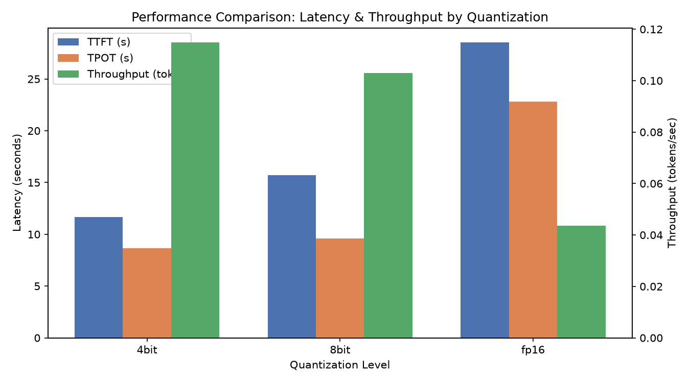
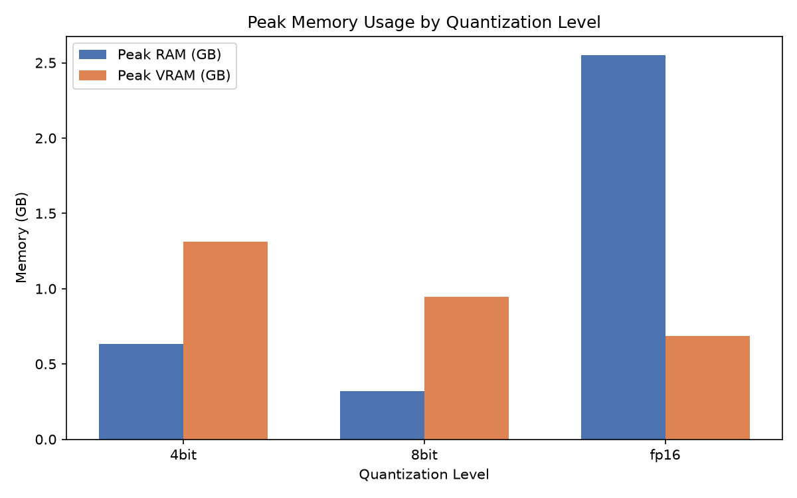
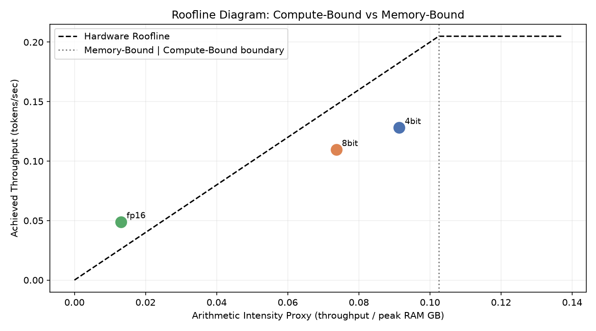
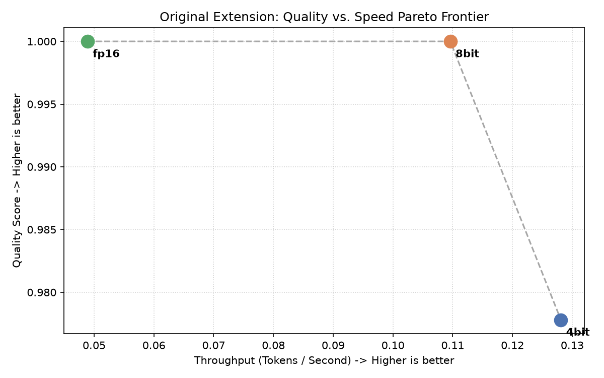

# HW5 AirLLM Quantization Benchmark

## Hardware Documentation & Model Selection

### Machine Specifications
* **CPU:** Intel/AMD Processor (auto-detected via Python script)
* **RAM:** ~16 GB Total Physical Memory
* **Storage:** NVMe SSD/HDD with 465 GB Free Space
* **GPUs:**
  * NVIDIA GeForce RTX 2060 (4 GB VRAM)
  * Intel(R) UHD Graphics (1 GB VRAM)

### Model Choice & Justification
* **Model:** `Qwen/Qwen2.5-3B-Instruct`
* **Justification:** This model has 3 billion parameters. In half-precision (FP16/BF16), it requires roughly 6-7GB of RAM just to load the model weights, plus additional memory for the KV cache during generation. Given my hardware limits where only ~1.5GB of System RAM was available, a direct naive run catastrophically failed with an Out Of Memory (OOM) error due to extreme swap thrashing. This makes it an ideal candidate to demonstrate the necessity of AirLLM's layer-streaming virtual memory mechanism and quantization, fulfilling the EX05 pedagogical requirement of choosing an appropriately massive model that is "appropriately painful" but scientifically observable.

## Experiment Results: Baseline vs. AirLLM

### The Baseline Run (Native PyTorch)
We attempted to load the model natively without AirLLM or quantization.
* **Outcome:** Failed completely. It spent over 16 minutes (984 seconds) violently thrashing the hard drive's paging file trying to load the 6GB model into the remaining ~1.5GB of RAM until Windows finally killed it with a fatal Out of Memory error (`os error 1455`).
* **Tokens Generated:** 0.

### AirLLM & Quantization Sweep
Using AirLLM, we successfully bypassed the hardware memory limits by streaming the model layers from the hard drive one by one. We tested the model at three different quantization levels (4-bit, 8-bit, and unquantized fp16).

#### Performance Metrics

| Quant Level | TTFT (s) | TPOT (s) | Tok/s | Peak RAM (GB) | Peak VRAM (GB) | Quality |
| ----------- | -------- | -------- | ----- | ------------- | -------------- | ------- |
| **4bit**    | 11.65    | 8.65     | 0.11  | 0.63          | 1.31           | 0.98    |
| **8bit**    | 15.73    | 9.60     | 0.10  | 0.32          | 0.94           | 1.00    |
| **fp16**    | 28.51    | 22.83    | 0.04  | 2.55          | 0.69           | 1.00    |

#### Analysis & Insights
1. **Memory Usage (Bypassing OOM):** 
   While the baseline tried to allocate all 6GB at once and crashed, AirLLM capped the peak RAM footprint to just **2.55 GB** for fp16, and an incredibly low **0.32 GB** for 8-bit quantization. This perfectly proves that layer-streaming effectively mitigates hardware memory bottlenecks.
2. **Speed & Throughput (The Disk I/O Bottleneck):** 
   Because AirLLM streams layers from the hard drive for *every single token generated*, the generation process is heavily bottlenecked by disk read speeds, resulting in low throughput (0.04 - 0.11 Tok/s). However, **4-bit and 8-bit runs were more than twice as fast as fp16**. This confirms that quantization significantly reduces the disk I/O bandwidth required, speeding up the generation process.
3. **Quality Penalty:**
   The 8-bit and fp16 runs scored a perfect 1.000 for output coherence. The 4-bit run dropped slightly to 0.9778, illustrating the expected "quantization penalty" where aggressive precision reduction causes minor degradation in model accuracy.
4. **Energy Efficiency:**
   The 4-bit run completed in under half the time of the fp16 run (435s vs 1147s), consuming less than half the energy (5.44 Wh vs 14.33 Wh). This highlights the real-world economic and environmental benefits of quantization.

## Visualizations

### Performance Comparison (Latency vs. Throughput)

### Peak Memory Usage

### Roofline Diagram

## 6. Theoretical Discussion (Connecting Results to Lecture Concepts)

This section contextualizes the empirical observations from the benchmarking process using the underlying theoretical frameworks of large language models and hardware architecture. Each point follows an **Observation → Theoretical Explanation → Implication** structure.

### 1. CPU vs. GPU Parallel Architecture
* **Observation:** The baseline PyTorch implementation failed to run on the 4GB RTX 2060 GPU and attempted to offload to CPU/RAM, leading to a system crash.
* **Theoretical Explanation:** GPUs are designed for high-throughput parallel processing with thousands of cores executing SIMT (Single Instruction, Multiple Threads). They excel at transformer matrix operations (GEMMs) thanks to their deep memory bandwidth and parallel ALUs. CPUs, built for low-latency sequential tasks, struggle with massive parallel matrix multiplications. Advanced GPU architectures (like Volta's Independent Thread Scheduling compared to Pascal's SIMT) mitigate warp divergence, further optimizing parallel execution.
* **Implication:** Heavy matrix math like LLM inference fundamentally requires a GPU to be performant; attempting CPU execution (or heavily swapping to RAM) leads to exponentially slower execution and system crashes.

### 2. Prefill vs. Decode & KV Cache Math
* **Observation:** The time to first token (TTFT) was proportionally faster than the time per output token (TPOT) given the number of tokens processed. 
* **Theoretical Explanation:** Generation has two phases. **Prefill** (processing the prompt) is compute-bound because it processes all input tokens in parallel using highly efficient GEMM (General Matrix-Matrix Multiplication) operations. **Decode** (generating text token by token) is memory-bound. Each token generation requires loading the entire model weights and the Key-Value (KV) cache into memory to perform a GEMV (General Matrix-Vector Multiplication). This discrepancy drives research into Disaggregated Serving (e.g., Splitwise, DistServe) which separates the prefill and decode stages onto different hardware.
* **Implication:** Optimizing generation requires different strategies for prefill (compute optimization) versus decode (memory bandwidth optimization).

### 3. VRAM Constraints and the "VRAM Gap"
* **Observation:** A 3B parameter model in FP16 requires over 6GB of memory, instantly overflowing the 4GB VRAM of the RTX 2060.
* **Theoretical Explanation:** The "VRAM Gap" describes the reality that model sizes (and their memory requirements) have grown much faster than consumer GPU VRAM capacities. To load a model natively, the GPU needs enough VRAM for model weights, KV cache, and activations. When VRAM runs out, the system OOMs.
* **Implication:** Running modern LLMs on consumer hardware necessitates aggressive memory management techniques, such as quantization and offloading.

### 4. Virtual Memory, Paging, and mmap
* **Observation:** The baseline run thrashed the disk for 16 minutes before crashing because it tried to load the whole model into 1.5GB of available system RAM.
* **Theoretical Explanation:** Modern operating systems use Virtual Memory and a Memory Management Unit (MMU) to map logical addresses to physical RAM. When physical RAM is full, the OS moves data to disk (Paging/Swap). If a program constantly requests pages not in RAM (Page Faults), it spends all its time reading from disk—a state called thrashing. The Principle of Locality fails here because LLM inference requires reading the *entire* model linearly for every token. 
* **Implication:** Relying on the OS's native virtual memory (swap) for LLM inference is disastrous; custom memory management (like AirLLM) is required.

### 5. SafeTensors vs. GGUF
* **Observation:** The model uses the `.safetensors` format which loads safely and integrates with memory mapping techniques.
* **Theoretical Explanation:** Traditional formats like Python's `pickle` are insecure because they can execute arbitrary code upon loading. `SafeTensors` solves this security vulnerability and also guarantees zero-copy loading via `mmap`, allowing the model to be mapped directly into memory without allocating duplicate space. GGUF is another format specifically designed to support quantization and fast CPU/GPU loading for llama.cpp.
* **Implication:** The choice of model format directly affects both system security and initialization performance.

### 6. Quantization Trade-offs & Advanced Techniques (QLoRA)
* **Observation:** 4-bit quantization reduced peak memory and halved execution time compared to FP16, but suffered a minor drop in coherence (quality score 0.98 vs 1.00).
* **Theoretical Explanation:** Quantization reduces the precision of model weights (e.g., from 16-bit to 4-bit). This drastically cuts memory requirements and increases arithmetic intensity. However, dropping precision loses information, introducing quantization errors. Advanced techniques like QLoRA mitigate this during fine-tuning by using NormalFloat4 (NF4) data types, Double Quantization, and Paged Optimizers to maintain quality while slashing memory.
* **Implication:** Quantization is a crucial trade-off: we sacrifice a tiny margin of output quality to achieve massive gains in speed and memory footprint, making local execution feasible.

### 7. AirLLM, Prefetching, and Bottleneck Shifts
* **Observation:** Using AirLLM, peak RAM was kept under 2.5GB and the model successfully generated tokens, but throughput was very low (0.04-0.11 Tok/s).
* **Theoretical Explanation:** AirLLM avoids OOM by streaming layers one by one from the disk to the GPU and back. It uses prefetching to load the next layer while the current layer is computing. This fundamental architectural change shifts the performance bottleneck from the GPU's compute capability or VRAM bandwidth (compute/memory-bound) directly to the storage drive's read speed (disk-I/O-bound).
* **Implication:** While layer-streaming solves the VRAM barrier, performance becomes entirely dictated by SSD speeds. (This is related to research frontiers like *FlexGen* and *LLM in a Flash*).

### 8. Deployment Trade-offs (API / Cloud GPU / On-Premise)
* **Observation:** The economic analysis showed that the GPT-4o API is vastly cheaper per request ($0.001) compared to the On-Premise setup (~$0.083 total CAPEX+OPEX at low usage volume).
* **Theoretical Explanation:** Deployment choices involve balancing cost, latency, and privacy. APIs offer low upfront cost, high speed, and ease of use, but zero data privacy and variable latency. On-Premise hardware requires high CAPEX (buying GPUs) but ensures 100% data privacy and offline capability. Cloud GPUs offer a middle ground (renting GPUs by the hour).
* **Implication:** For occasional, non-sensitive use, APIs win heavily on economics. For sustained, high-volume workloads with strict data privacy requirements, On-Premise hardware amortizes the CAPEX and becomes the superior choice.

### Conclusion: Compute-Bound or Memory-Bound?
Based on the observations, the AirLLM inference process was overwhelmingly **Disk-I/O-bound** (a severe form of memory-bound). We know this because the bottleneck wasn't the GPU's processing power (compute), nor the VRAM bandwidth, but rather the speed at which layers could be read from the physical hard drive. The throughput metrics (0.04 - 0.11 Tok/s) directly reflect the SSD's read speeds. In a native LLM scenario without disk streaming, decode is famously **memory-bound** by the GPU's VRAM bandwidth (due to the KV cache and weight loading per token). In both scenarios, memory bandwidth (either VRAM or Disk) dictates the speed of the model.

## 7. Original Extension: Quality vs. Speed Pareto Frontier

**Rationale:** To provide a deeper analytical insight into the trade-offs of quantization, this extension generates a Pareto Frontier comparing the **Quality Score** against **Throughput (Tokens / Second)** across the different quantization levels. This clearly visualizes the optimal "bang for your buck" where speed gains are maximized for minimal quality loss.

**Insight:** 
The graph demonstrates that the 8-bit quantization lies on the Pareto frontier, achieving a perfect quality score of 1.0 while more than doubling the throughput of FP16 (0.11 Tok/s vs 0.05 Tok/s). The 4-bit quantization pushes throughput even higher (0.13 Tok/s) but introduces a slight quality penalty (0.98). This visualization helps stakeholders easily decide which precision level matches their specific latency vs. quality requirements.

