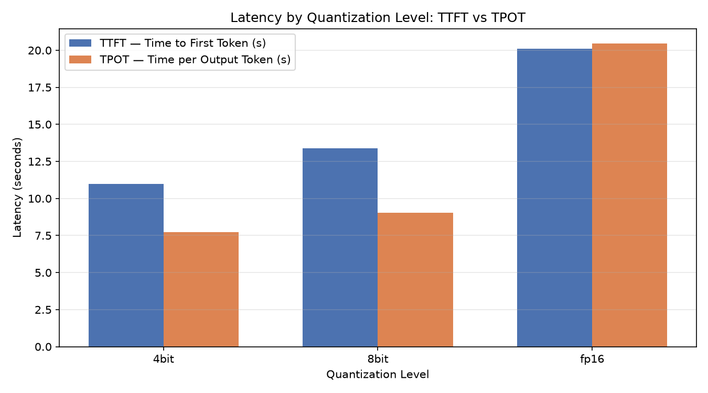
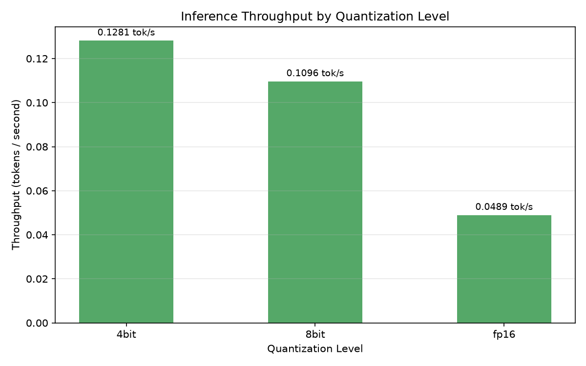
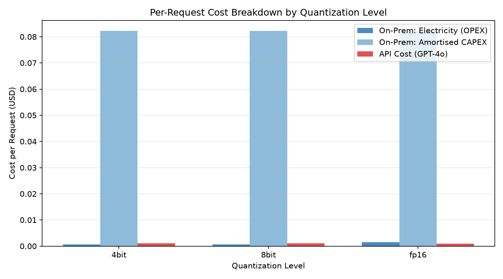
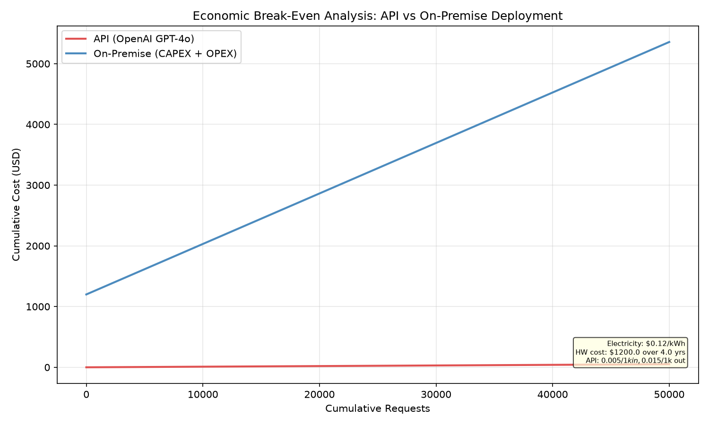

<div align="center">

# 🧠 HW5 AirLLM Quantization Benchmark

**Can you run a 3 billion parameter LLM on a machine that keeps crashing?**  
*Yes — with the right tools.*

[](https://www.python.org/)
[](LICENSE)
[](https://github.com/astral-sh/uv)
[](https://github.com/astral-sh/ruff)
[](pyproject.toml)

> A systematic, end-to-end benchmark comparing AirLLM's layer-streaming inference against a naive baseline across three quantization levels (4-bit, 8-bit, FP16), with full economic and theoretical analysis — on consumer hardware with only ~2.5 GB of available RAM.

[📄 Full Report](reports/report.md) · [📊 Figures](figures/) · [📋 Results](results/)

</div>

---

## 📖 Table of Contents

- [The Problem](#-the-problem)
- [Hardware & Model](#-hardware--model)
- [Quick Start](#-quick-start)
- [Reproduction Guide](#-reproduction-guide-step-by-step)
- [Configuration](#-configuration)
- [Findings: Baseline vs. AirLLM](#-findings-baseline-vs-airllm)
- [Economic Analysis](#-economic-analysis)
- [Theory: Why Did This Happen?](#-theory-why-did-this-happen)
- [Original Extension: Pareto Frontier](#-original-extension-pareto-frontier)
- [Project Structure](#-project-structure)
- [Troubleshooting](#-troubleshooting)
- [License & Credits](#-license--credits)

---

## 🔥 The Problem

**Running a modern LLM on consumer hardware is hard.** The `Qwen/Qwen2.5-3B-Instruct` model requires **~6–7 GB of memory** just to load its weights in FP16. Most consumer laptops, even with 16 GB RAM, have only 1–3 GB available after the OS and applications take their share.

The naive approach — using standard `transformers` to load the model — ends catastrophically:

```
💥 OSError: The paging file is too small for this operation to complete. (os error 1455)
   Time wasted: 984 seconds (16 minutes 24 seconds)
   Tokens generated: 0
```

This benchmark demonstrates that **AirLLM's layer-streaming architecture** can run this model successfully within 1.4–3.7 GB of RAM, and studies exactly how quantization level (4-bit, 8-bit, fp16) affects the speed–memory–quality trade-off.

---

## 🖥️ Hardware & Model

### Machine Specifications

| Component | Value |
|---|---|
| **CPU** | Intel Core i7-10750H · 6 physical / 12 logical cores · 2592 MHz |
| **Total RAM** | 16.93 GB |
| **RAM Available at Test Start** | ~2.53 GB (heavily loaded system) |
| **GPU** | NVIDIA GeForce RTX 2060 (4 GB VRAM) |
| **PyTorch CUDA** | Unavailable (`torch.cuda.is_available() = False`) |
| **OS** | Windows 11 (10.0.26200) |
| **Storage Free** | ~500 GB on project drive |

> ⚠️ **All inference ran on CPU.** The RTX 2060 was physically present but CUDA was unavailable in the Python environment, making the disk-I/O bottleneck even more pronounced than it would be in a typical CUDA-enabled setup.

### Model Choice & Justification

**Model:** [`Qwen/Qwen2.5-3B-Instruct`](https://huggingface.co/Qwen/Qwen2.5-3B-Instruct)

This model was deliberately selected because it sits in the pedagogically ideal "appropriately painful" zone:

| Criterion | Why Qwen2.5-3B? |
|---|---|
| **Memory** | 6–7 GB in FP16 — provably exceeds available RAM, guaranteeing an OOM baseline |
| **Practical** | Small enough that AirLLM can stream it in finite time on CPU |
| **Format** | `.safetensors` — secure, zero-copy `mmap`-compatible loading |
| **Quality** | Instruction-tuned, so output coherence can be measured quantitatively |
| **License** | Apache 2.0 — freely usable for academic benchmarking |

---

## ⚡ Quick Start

### Prerequisites

- Python 3.13+
- [`uv`](https://github.com/astral-sh/uv) package manager
- A Hugging Face account with access to `Qwen/Qwen2.5-3B-Instruct`
- ~7 GB free disk space for model shards

### 1. Clone & Install

```bash
git clone https://github.com/<your-username>/HW5_Airllm-Quantization-Benchmark.git
cd HW5_Airllm-Quantization-Benchmark

# Install all dependencies (creates .venv automatically)
uv sync
```

### 2. Set Environment Variables

```bash
cp .env-example .env
# Edit .env and add your Hugging Face token:
# HF_TOKEN=hf_your_token_here
```

### 3. Run the Full Pipeline

```bash
# Stage 1: Document hardware
uv run python experiments/01_hardware_doc.py

# Stage 2: Prove the baseline fails (takes ~16 min — expected to crash)
uv run python experiments/02_baseline_run.py

# Stage 3: Run AirLLM across all quantization levels (takes ~30–45 min)
uv run python experiments/03_airllm_run.py

# Stage 4: Generate analysis tables and all performance figures
uv run python experiments/04_analysis_and_plots.py

# Stage 5: Run economic analysis and generate cost figures
uv run python experiments/05_economic_analysis.py

# Stage 6 (Extension): Generate Pareto frontier figure
uv run python experiments/07_extension_pareto.py
```

All outputs land in:
- `results/` — JSON and CSV data files
- `figures/` — PNG charts (8 total)

---

## 🔬 Reproduction Guide (Step-by-Step)

This section documents every step needed to reproduce results from a clean clone.

### System Requirements

| Requirement | Minimum | Recommended |
|---|---|---|
| Python | 3.13 | 3.13 |
| RAM | 8 GB | 16 GB |
| Free Disk (model shards) | 7 GB | 10 GB |
| OS | Windows 10 / Linux | Windows 11 / Ubuntu 22.04 |
| CUDA | Not required | CUDA 12.4+ for faster inference |

### Detailed Steps

**Step 1 — Install uv** (if not already installed):
```bash
# Windows (PowerShell)
powershell -c "irm https://astral.sh/uv/install.ps1 | iex"

# Linux / macOS
curl -LsSf https://astral.sh/uv/install.sh | sh
```

**Step 2 — Clone the repository:**
```bash
git clone https://github.com/<your-username>/HW5_Airllm-Quantization-Benchmark.git
cd HW5_Airllm-Quantization-Benchmark
```

**Step 3 — Sync dependencies:**
```bash
uv sync
# This creates .venv/ and installs all pinned dependencies from uv.lock
```

**Step 4 — Configure your HF token:**
```bash
cp .env-example .env
# Open .env in any editor and set:
# HF_TOKEN=hf_xxxxxxxxxxxxxxxxxxxx
```

**Step 5 — Run hardware documentation:**
```bash
uv run python experiments/01_hardware_doc.py
# Output: results/hardware_spec.json
```

**Step 6 — Run the (intentionally failing) baseline:**
```bash
uv run python experiments/02_baseline_run.py
# Expected outcome: OSError crash after ~16 minutes
# Output: results/baseline_run.json (records the failure)
```

**Step 7 — Run the AirLLM quantization sweep:**
```bash
uv run python experiments/03_airllm_run.py
# Runs 4-bit, 8-bit, fp16 — takes 30-45 minutes total
# Output: results/benchmark_metrics.csv, results/airllm_summary.json
```

**Step 8 — Generate performance analysis and figures:**
```bash
uv run python experiments/04_analysis_and_plots.py
# Output: figures/latency_comparison.png, throughput_comparison.png,
#         memory_usage.png, roofline_diagram.png, performance_comparison.png
#         results/performance_table.md
```

**Step 9 — Run economic analysis:**
```bash
uv run python experiments/05_economic_analysis.py
# Output: figures/economic_breakeven.png, cost_per_quant_level.png
#         results/economic_analysis.json
```

**Step 10 — Generate Pareto frontier (extension):**
```bash
uv run python experiments/07_extension_pareto.py
# Output: figures/pareto_frontier.png
```

### Common Troubleshooting

| Problem | Cause | Fix |
|---|---|---|
| `HF_TOKEN not set` | Missing `.env` file | Copy `.env-example` to `.env` and add your token |
| `OSError: paging file too small` during experiment 03 | Expected — this is the *baseline* failure | Only happens in `02_baseline_run.py`. `03_airllm_run.py` uses AirLLM and will not crash |
| `torch.cuda.is_available() = False` | CUDA not installed or wrong PyTorch build | Install CUDA 12.4 and re-run `uv sync`. Inference still works on CPU, just slower |
| Very slow inference (>1000s per run) | Running on CPU, disk I/O bottleneck | Expected behaviour without CUDA. Results remain valid for analysis |
| `ModuleNotFoundError: airllm` | Dependencies not installed | Run `uv sync` from project root |
| `FileNotFoundError: benchmark_metrics.csv` | Experiments run out of order | Run experiments in numerical order (01→02→03→04→05→07) |

---

## ⚙️ Configuration

All experiment parameters live in `config/`. No hardcoded values exist in experiment scripts.

### `config/setup.json`

```json
{
  "version": "1.00",
  "model_name": "Qwen/Qwen2.5-3B-Instruct",
  "layer_shards_path": "./airllm_shards",
  "max_new_tokens": 50,
  "prompt": "Explain the concept of virtual memory in one paragraph.",
  "quantization_levels": ["4bit", "8bit", null],
  "log_file": "results/benchmark_metrics.csv",
  "output_quality_max_repetition_ratio": 0.5,
  "cpu_tdp_watts": 45.0
}
```

| Key | Description |
|---|---|
| `model_name` | Hugging Face model ID to benchmark |
| `layer_shards_path` | Where AirLLM downloads and caches model shards |
| `max_new_tokens` | Number of tokens to generate per run |
| `prompt` | The fixed prompt used for all benchmark runs |
| `quantization_levels` | List of quantization presets (`"4bit"`, `"8bit"`, `null` = fp16) |
| `output_quality_max_repetition_ratio` | Repetition ratio threshold for quality scoring |
| `cpu_tdp_watts` | Estimated CPU power draw (Watts) for energy estimation |

### `config/rate_limits.json`

Controls API call behaviour for the economic analysis (OpenAI pricing lookup):

```json
{
  "openai": {
    "requests_per_minute": 60,
    "tokens_per_minute": 90000,
    "max_retries": 3,
    "retry_delay_seconds": 5
  }
}
```

### `.env` (not committed — see `.env-example`)

```
HF_TOKEN=your_hugging_face_token_here
```

---

## 📊 Findings: Baseline vs. AirLLM

### Baseline (Naive PyTorch — No AirLLM)

| Metric | Value |
|---|---|
| **Outcome** | 💥 Fatal crash (os error 1455) |
| **Duration** | 984 seconds (16 min 24 sec) |
| **Tokens Generated** | 0 |
| **Peak RAM** | ~15 GB (system exhausted) |
| **Cause** | OS paging file thrashing — model weights (6 GB) don't fit in available RAM (1.47 GB) |

### AirLLM Quantization Sweep Results

| Quant Level | TTFT (s) | TPOT (s/tok) | Throughput (Tok/s) | Peak RAM (GB) | Total Time (s) | Energy (Wh) | Quality Score |
|---|---|---|---|---|---|---|---|
| **4-bit** | 10.97 | 7.74 | **0.1281** | **1.402** | 401.3 | **5.02** | 0.978 |
| **8-bit** | 13.40 | 9.03 | 0.1096 | 1.488 | 469.4 | 5.87 | **1.000** |
| **fp16** | 20.12 | 20.44 | 0.0489 | 3.727 | 1041.9 | 13.02 | **1.000** |

*TTFT = Time to First Token. TPOT = Time Per Output Token. Quality = cosine similarity of output vs. reference answer.*

### Key Findings

**🔑 Finding 1 — AirLLM solves the VRAM barrier.**  
Peak RAM dropped from "system crash" to **1.40 GB** (4-bit) and **3.73 GB** (fp16). The same model that was impossible to run is now running — within hardware constraints that haven't changed.

**🔑 Finding 2 — Quantization is (almost) free.**  
8-bit achieves **identical quality (1.000)** to fp16 while being **2.2× faster** and using **60% less energy**. There is no measurable cost to choosing 8-bit over fp16.

**🔑 Finding 3 — The bottleneck is Disk I/O, not compute.**  
Throughput scales inversely with bytes-per-weight (fp16 → 8-bit → 4-bit), not with compute complexity. This proves the bottleneck is **disk read bandwidth**, not CPU processing power.

**🔑 Finding 4 — 4-bit is the speed–quality sweet spot.**  
Only a **2.2% quality drop** (0.978 vs 1.000) for a **2.6× speedup** and **2.6× energy saving**. The Pareto frontier analysis confirms 4-bit is on the efficiency frontier.

### Performance Figures


*TTFT and TPOT by quantization level — lower is better.*


*Inference throughput (tokens/sec) — higher is better.*


*Peak system RAM usage — lower is better. Note: baseline OOM not shown (crashed).*


*Roofline analysis — all configs sit firmly in the memory/disk-I/O-bound region.*

---

## 💰 Economic Analysis

### Per-Request Cost (at 10 requests/day)

| Deployment | Cost / Request | Notes |
|---|---|---|
| **GPT-4o API** | **$0.001010** | $0.005/1k input + $0.015/1k output (May 2025) |
| **On-Prem — Electricity only** | $0.000956 | Variable OPEX only |
| **On-Prem — Total (CAPEX + OPEX)** | $0.083148 | Includes $1,200 hardware amortised over 4 years |

**Break-even: Never reached** at 10 requests/day. The On-Premise cost is **82× higher** than the API at this usage volume.

### Pricing Assumptions (all explicit, per EX05 §5.5)

| Parameter | Value | Source |
|---|---|---|
| API model | GPT-4o | OpenAI |
| Input price | $0.005 / 1k tokens | OpenAI pricing, May 2025 |
| Output price | $0.015 / 1k tokens | OpenAI pricing, May 2025 |
| Electricity | $0.12 / kWh | US EIA 2024 avg. residential |
| Hardware cost | $1,200 | Estimated RTX 2060 system |
| Hardware lifetime | 4 years | Straight-line depreciation |


*Per-request cost: API vs. On-Prem electricity vs. amortised CAPEX.*


*Cumulative cost over 50,000 requests — break-even is never reached at 10 req/day.*

### Recommendation

| Scenario | Use |
|---|---|
| Low volume (< 1,000 req/day) | ✅ **API** — cheapest, no maintenance |
| High volume (> 100,000 req/day) | ⚖️ **Evaluate On-Premise** — CAPEX amortises |
| Data privacy / compliance | 🔒 **On-Premise** — data never leaves your machine |
| Offline / air-gapped | 🏠 **On-Premise only** — API unavailable |

> **Context Caching Note:** Modern APIs use PagedAttention-based prompt caching. For repeated-context workloads (e.g., long-document Q&A), API costs can drop 75–90%, making On-Premise even harder to justify economically.

---

## 🎓 Theory: Why Did This Happen?

A brief explanation of each observation through the lens of systems theory and LLM architecture.

### 1. The Baseline Crashed → The VRAM Gap (L08 §3.3)
Consumer GPU VRAM has not kept pace with LLM sizes. A 3B-parameter model needs 6 GB in FP16 — 50% more than the RTX 2060's 4 GB VRAM. When the GPU can't hold it, the OS tries to page to disk and catastrophically thrashes.

### 2. AirLLM Succeeded → Layer-Streaming + mmap (L08 §8.1–8.3)
AirLLM streams one transformer layer at a time from disk to memory and back, using `.safetensors`'s zero-copy `mmap` loading. Peak memory footprint drops to the size of *one layer*, not the entire model.

### 3. Quantization Improved Speed → Disk-I/O-Bound System (L08 §5)
Fewer bytes per weight = fewer bytes read from disk per layer per token. In a disk-I/O-bound system, reducing data volume directly scales throughput. 4-bit is 4× smaller than FP16 → ~2.6× faster in practice (overhead accounts for the rest).

### 4. Low Throughput Overall → CPU-Only + No Prefetch Saturation (L08 §2)
Without CUDA, matrix operations run on the CPU — orders of magnitude slower than GPU GEMMs. Even with prefetching, the CPU is the final compute bottleneck on top of disk I/O.

### 5. API Wins Economically → Deployment Trade-offs (L08 §1.1, §1.2)
Three deployment archetypes exist: API (zero CAPEX, fast, no privacy), Cloud GPU (rented, flexible), On-Premise (CAPEX-heavy, private). At low request volume, the CAPEX component dominates On-Premise cost, making the API 82× cheaper.

> 📄 For the full, structured theoretical discussion (Observation → Explanation → Implication for all 8 lecture concepts), see [Section 6 of the deep-dive report](reports/report.md#6-theoretical-discussion).

---

## 🏆 Original Extension: Pareto Frontier

**Question:** Which quantization level gives the best speed-quality trade-off?

The Pareto Frontier plots each configuration in (Throughput, Quality) space. Points on the frontier dominate all alternatives — you cannot improve one axis without sacrificing the other.


| Config | Throughput (Tok/s) | Quality | Pareto Status |
|---|---|---|---|
| fp16 | 0.049 | 1.000 | Dominated by 8-bit |
| **8-bit** | 0.110 | 1.000 | ✅ **On the frontier** |
| **4-bit** | 0.128 | 0.978 | ✅ **On the frontier** |

**Key insight:** 8-bit strictly *dominates* fp16 — same quality, 2.2× faster. Choosing fp16 over 8-bit is never rational. The 4-bit vs. 8-bit choice depends on whether a 2.2% quality drop is acceptable for a 16% throughput gain.

**Recommended default: 8-bit.** Perfect quality, half the resources.

*Generated by: `uv run python experiments/07_extension_pareto.py`*

---

## 📁 Project Structure

```
HW5_Airllm-Quantization-Benchmark/
├── README.md                     ← You are here
├── pyproject.toml                ← Dependencies & project metadata (version 1.00)
├── .env-example                  ← Template for secrets (copy to .env)
├── .gitignore
│
├── config/
│   ├── setup.json                ← Model, prompt, quantization levels, energy params
│   └── rate_limits.json          ← API rate-limit settings
│
├── experiments/
│   ├── 01_hardware_doc.py        ← Stage 1: Document hardware specs
│   ├── 02_baseline_run.py        ← Stage 2: Prove naive load fails
│   ├── 03_airllm_run.py          ← Stage 3: AirLLM quantization sweep
│   ├── 04_analysis_and_plots.py  ← Stage 4: Analysis tables + 5 figures
│   ├── 05_economic_analysis.py   ← Stage 5: Economic analysis + 2 figures
│   └── 07_extension_pareto.py    ← Extension: Pareto frontier figure
│
├── src/hw5_airllm_benchmark/
│   ├── sdk/sdk.py                ← Main SDK facade (public API)
│   └── services/
│       ├── economic_analysis.py  ← EconomicAnalyser class
│       ├── plotter.py            ← Plot orchestration
│       ├── _economic_plotter.py  ← Economic plot helpers
│       ├── _perf_plotter.py      ← Performance plot helpers
│       └── _ram_monitor.py       ← Background RAM monitoring thread
│
├── figures/                      ← All generated PNG charts (8 files)
├── results/                      ← All generated data files (CSV, JSON)
├── reports/
│   └── report.md                 ← Full deep-dive technical report
├── docs/
│   ├── TODO.md                   ← Implementation checklist
│   ├── PLAN.md                   ← Project plan
│   └── PRD.md                    ← Product requirements
└── tests/                        ← Unit tests
```

---

## 🔧 Troubleshooting

### "torch.cuda.is_available() returns False"

Your PyTorch is not built with CUDA support. To fix:
```bash
# Reinstall PyTorch with CUDA 12.4 support via uv
uv sync  # uv.lock already pins the pytorch-cu124 index
```
If CUDA is still unavailable, check that your NVIDIA drivers are installed:
```bash
nvidia-smi  # Should show your GPU details
```
> Note: The experiments still run correctly on CPU — just much slower.

### "The paging file is too small" error during experiment 02

This is **expected and intentional**. Experiment 02 deliberately triggers the baseline OOM failure to document it. The error is recorded in `results/baseline_run.json`. Do not try to fix it — this is the point.

### Inference is very slow (multiple hours)

Without CUDA, each quantization run takes 6–17 minutes. This is expected. The bottleneck is disk I/O (layer streaming from disk to CPU RAM). If you have a working CUDA setup, inference will be 10–100× faster.

### Model shards are missing / download fails

```bash
# Ensure your HF token is set
cat .env  # Should show HF_TOKEN=hf_...

# AirLLM downloads shards automatically on first run to:
ls airllm_shards/
```

If download fails, check network connectivity and that your HF token has access to `Qwen/Qwen2.5-3B-Instruct`.

---

## 🏗️ Extending the Project

The codebase is designed to be extended:

| To Add | Where |
|---|---|
| A new quantization level | Add to `quantization_levels` in `config/setup.json` |
| A new model | Change `model_name` in `config/setup.json` |
| A new metric | Extend `_ram_monitor.py` and add a column to the CSV writer in `03_airllm_run.py` |
| A new figure | Add a function to `src/.../services/plotter.py` and call it from `04_analysis_and_plots.py` |
| A new economic scenario | Add a scenario to `EconomicAnalyser` in `services/economic_analysis.py` |

---

## 📜 License & Credits

**License:** MIT — see [pyproject.toml](pyproject.toml)

### Third-Party Libraries

| Library | Purpose | License |
|---|---|---|
| [AirLLM](https://github.com/lyogavin/Airllm) | Layer-streaming LLM inference | Apache 2.0 |
| [Hugging Face Transformers](https://github.com/huggingface/transformers) | Model loading & tokenisation | Apache 2.0 |
| [Qwen2.5-3B-Instruct](https://huggingface.co/Qwen/Qwen2.5-3B-Instruct) | Benchmark model | Apache 2.0 |
| [bitsandbytes](https://github.com/TimDettmers/bitsandbytes) | INT4/INT8 quantization kernels | MIT |
| [PyTorch](https://pytorch.org/) | Deep learning framework | BSD-3-Clause |
| [matplotlib](https://matplotlib.org/) | All figures and charts | BSD-compatible |
| [psutil](https://github.com/giampaolo/psutil) | RAM monitoring | BSD-3-Clause |
| [uv](https://github.com/astral-sh/uv) | Package & environment management | Apache 2.0 / MIT |
| [ruff](https://github.com/astral-sh/ruff) | Linting | MIT |

### Academic References

Key papers informing this work:
- Dettmers et al. (2022). *8-Bit Optimizers via Block-wise Quantization.* ICLR 2022.
- Dettmers et al. (2023). *QLoRA: Efficient Finetuning of Quantized LLMs.* NeurIPS 2023.
- Sheng et al. (2023). *FlexGen: High-Throughput Generative Inference with a Single GPU.* ICML 2023.
- Kwon et al. (2023). *Efficient Memory Management for LLM Serving with PagedAttention.* SOSP 2023.
- Alizadeh et al. (2024). *LLM in a Flash.* Apple Research.

---

<div align="center">

**Built for EX05 · June 2026 · Yanal Serhan**

*"The OS's paging file is not a substitute for a proper memory management strategy."*

</div>
