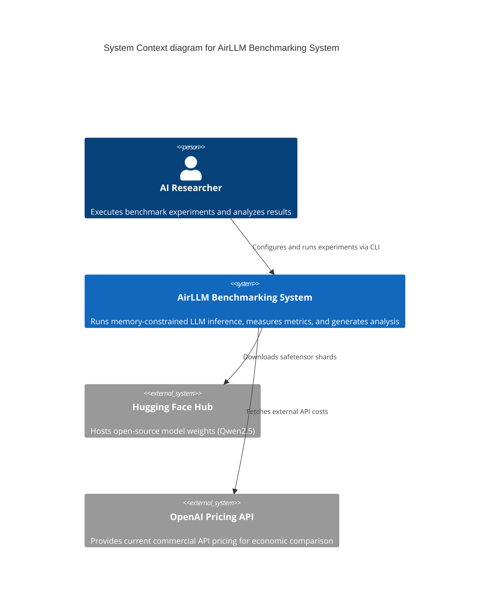
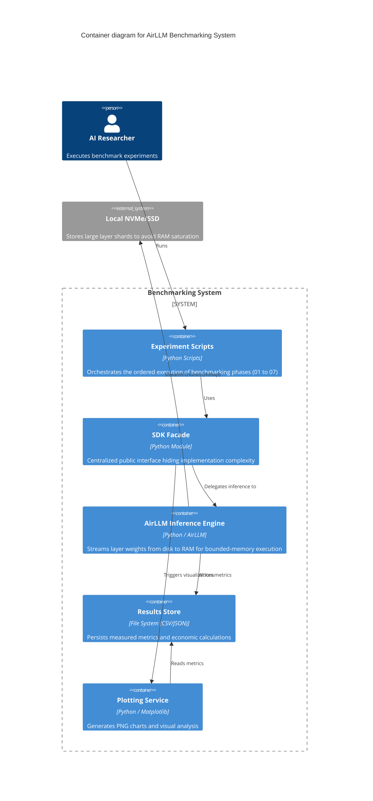
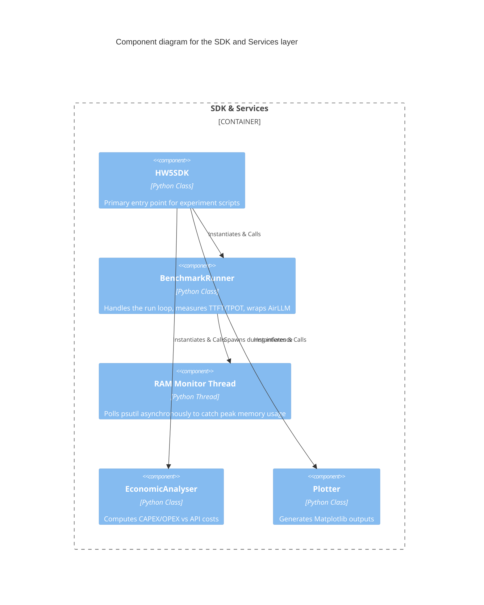

# Technical Plan & Experimental Design (PLAN)

## 1. Experimental Design Overview
The project follows a highly structured, empirical approach to prove the necessity and effectiveness of virtual memory techniques in LLM inference.

1. **Phase 1: Baseline Direct Run**
   - Attempt to load the `Qwen2.5-3B-Instruct` model natively using Hugging Face `transformers.AutoModelForCausalLM`.
   - **Expectation:** Immediate OOM exception or system freeze due to extreme swap thrashing on limited RAM.
   - **Action:** Catch the OS-level exception, log the crash state (peak memory), and save as a negative baseline result.

2. **Phase 2: Quantization Sweep via AirLLM**
   - Run the benchmarking harness using `airllm.AutoModel`.
   - Iterate through three precision configurations:
     - 4-bit Quantization (Q4 - bitsandbytes)
     - 8-bit Quantization (Q8 - bitsandbytes)
     - FP16 (Baseline AirLLM, no compression)
   - Use a strictly controlled random seed and prompt length to ensure deterministic comparisons.

3. **Phase 3: Data Collection & Metrics**
   - For every run, collect precisely:
     1. TTFT (Time To First Token)
     2. TPOT (Time Per Output Token)
     3. Throughput (Tokens/second)
     4. Peak RAM usage
     5. Estimated Energy consumption
     6. Output Quality (Cosine similarity against reference answer)
   - Save directly to `results/benchmark_metrics.csv`.

4. **Phase 4: Original Extension (Pareto Analysis)**
   - Plot the derived *Output Quality vs. Throughput* curve.
   - Mathematically define the Pareto-optimal frontier to find the configuration that provides the best trade-off.

## 2. Architecture Diagrams (C4 Model)

The following diagrams illustrate the architecture from a high-level system context down to specific components.

### 2.1 Context Diagram (C4 Level 1)

### 2.2 Container Diagram (C4 Level 2)

### 2.3 Component Diagram (C4 Level 3: SDK & Services)

## 3. Visualizations Planned
- **Performance Comparison Table:** Cross-tabulating all metrics across the baseline and three quantization levels.
- **Throughput & TTFT Bar Charts:** Visual comparison of speed metrics, clearly segregating Prefill (TTFT) and Decode (TPOT).
- **Peak Memory Usage Bar Chart:** Proving the efficacy of layer streaming.
- **Roofline Diagram:** Showing configurations plotted against theoretical hardware compute/memory bandwidth bounds.
- **Economic Break-Even Graph:** Cost curve mapping Local On-Prem cumulative cost against External API cumulative cost.
- **Pareto Frontier Plot:** 2D scatter of Quality vs Throughput.

## 4. ADRs (Architecture Decision Records) Highlights

- **ADR-1: Layer Streaming over Swap Memory:** Native OS swap leads to catastrophic thrashing with large models. We explicitly force AirLLM's application-level streaming (`mmap` via safetensors) to bypass OS virtual memory limitations.
- **ADR-2: Centralized Plotting Service:** Instead of littering matplotlib code inside experiment scripts, all charting logic is contained within the `Plotter` service. This enforces the Single Responsibility Principle and keeps scripts < 150 lines.
- **ADR-3: Asynchronous RAM Monitoring:** Peak RAM cannot be accurately measured synchronously because Python garbage collection and tensor allocation happen opaquely in C. A dedicated background thread (`_ram_monitor.py`) polls `psutil` at 100ms intervals to capture the true peak spike.
